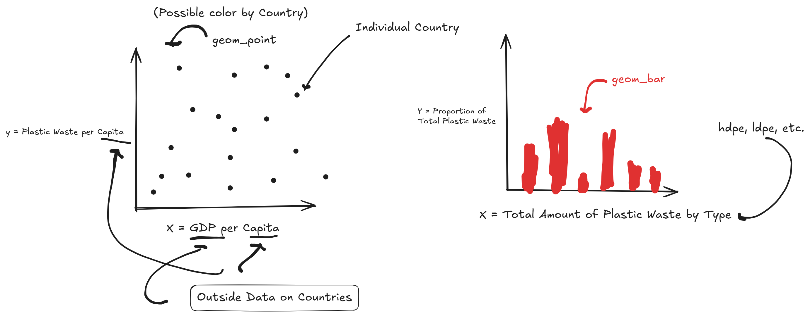

```{r}
# Get the Data

# Read in with tidytuesdayR package 
# Install from CRAN via: install.packages("tidytuesdayR")
# This loads the readme and all the datasets for the week of interest

# Either ISO-8601 date or year/week works!

tuesdata <- tidytuesdayR::tt_load('2021-01-26')
tuesdata <- tidytuesdayR::tt_load(2021, week = 5)

plastics <- tuesdata$plastics

# Or read in the data manually

plastics <- readr::read_csv('https://raw.githubusercontent.com/rfordatascience/tidytuesday/main/data/2021/2021-01-26/plastics.csv')

```

This dataset comes from global plastic waste cleanup efforts, provided by *Break Free from Plastic*, where volunteers collect and categorize plastic items found in the environment. The data were cleaned by Sarah Suave, who posted her approach to the data in a blog post. Her goal was to make the data available to raise awareness and contribute to the bigger project of understanding plastic sources in our countries. Each row in data represents a cleanup outcome for a specific country, year (2019 or 2020), and the parent company (whats the source of plastic).

The data records counts of different types of plastic materials collected, including plastic type such as HDPE (High density polyethylene count), LDPE (Low density), Polyester (PET), polypropylene, polystyrene, PVC and other. The resulting total number of plastic items is stored in a separate column and is the sum of the number of plastic items in each type.

With this dataset, we are able to look and study how plastic waste varies by geography, material type and source company across a two year period.

The data was cleaned by first combining multiple country-level CSV files for each year into a single dataset using row-binding. Column types were explicitly specified to ensure consistency across files, with categorical variables stored as character and count variables as numeric. A year variable was added to distinguish observations from 2019 and 2020. The grand total variable was converted from character to numeric using a parsing function, parse_number(), to remove punctuation. Names were also converted to lowercase. The 2019 data required additional cleaning to resolve inconsistencies, including extracting country names from file names, renaming variables to match the 2020 structure, and combining duplicated columns (e.g., pp and pp_2, ps and ps_2). After merging duplicate columns, the redundant variables were removed. These steps resulted in a unified dataset with consistent structure across both years.

On top of the data cleaning done as preparation, there were some observations with missing data. In many of the cases, plastic was all classified under "other", which provides an incorrect split of plastic types. This proves problematic for visualizing things like the split of plastic types because these plastics are almost certainly classified incorrectly. It would be misleading sense to replace these with zeros if interested in plastic types, so instead we likely have to drop these rows to maintain correctness.


## Checkpoint 1

Questions that can be answered with this dataset alone:

 - Which type of plastic dominates waste globally? In countries that produce the most plastic waste (US, China, India, etc.)?
 
 - Which companies contribute the most to global plastic waste?
 
 Questions that need outside data:
 
 - Which countries produce the most plastic waste per capita? How does a country's GDP relate their plastic waste production? Requires descriptive data on countries.
 
 - Of countries that produce less waste, which also have a high recycling rate? Need data on recycling tendencies of countries.

- Is plastic pollution associated with product sales? Need access to company's sales for each country.


```{r}
#| label: fig-plots
#| fig-cap: "Left plot answers the question about plastic waste per capita, with the additional possibility for analysis by region. Right plot answers the question about which type of plastic dominates waste."


```

```{r}
library(tidyverse)
library(gt)
```

## Table 1

```{r}
#| label: Unmodified custom function
summarize_effort <- function(data) {
  data %>%
    group_by(year) %>%
    summarise(
        avg_grand_total = round(mean(grand_total, na.rm = TRUE), 3),
        avg_num_events = round(mean(num_events, na.rm = TRUE), 3),
        avg_volunteers = round(mean(volunteers, na.rm = TRUE), 3),
      .groups = "drop"
    )
}

summary_existing_1 <- summarize_effort(plastics)

colnames(summary_existing_1) <- c("Year", "Avg Total Plastic", "Avg Events", "Avg Volunteers")

```

```{r}
#| label: table1 w/ gt

table1 <- summary_existing_1 |>
  gt()

table1 <- table1 |>
  cols_label(
    Year = md("**Year**"),
    `Avg Total Plastic` = md("**Avg Total Plastic**"),
    `Avg Events` = md("**Avg Events**"),
    `Avg Volunteers` = md("**Avg Volunteers**")
  ) |>
  fmt_number(
    columns = c(`Avg Total Plastic`, `Avg Events`, `Avg Volunteers`),
    decimals = 2
  ) |>
  tab_header(
    title = md("**Table 1: Summary of Cleanup Effort by Year**")
  ) |>
  tab_source_note(
    source_note = "Average total plastic collected, number of events, and volunteers by year."
  )

table1
```

## Table 2

Doesn't Modify Existing Columns, has iteration and custom function

```{r}
plastic_types <- c("hdpe", "ldpe", "o", "pet", "pp", "ps", "pvc")

dominant_plastic <- function(ctry) {
  df <- plastics %>%
    filter(country != "EMPTY") %>%
    mutate(country = str_to_title(country)) %>%   # match the casing
    filter(country == ctry) %>%
    summarise(across(all_of(plastic_types), ~ sum(.x, na.rm = TRUE)))
  
  tibble(
    country       = ctry,
    dominant_type = plastic_types[which.max(df)],
    dominant_n    = max(df)
  )
}

top_countries <- plastics %>%
  filter(country != "EMPTY") %>% 
  mutate(country = str_to_title(country)) %>% 
  group_by(country) %>%
  summarise(total = sum(grand_total, na.rm = TRUE)) %>%
  slice_max(total, n = 10) %>%
  pull(country)

top_countries %>%
  map(dominant_plastic) %>%
  list_rbind() %>%
  arrange(desc(dominant_n)) %>%
  mutate(dominant_type = dominant_type %>% 
           recode_values(
             "o" ~ "Other", 
             "ldpe" ~ "Low-Density Polyethylene",
             "hdpe" ~ "High-Density Polyethylene",
             "pet" ~ "Polyester",
             "pp" ~ "Polypropylene",
             "ps" ~ "Polystyrene",
             "pvc" ~ "PVC")
  ) %>% 
  gt() %>%
  tab_header(
    title = md("**Table 2: Dominant Plastic Type in Top 10 Waste-Producing Countries**")
    ) %>%
  tab_caption(
    caption = md("Most commonly recorded plastic type for the countries producing the largest amount of plastic waste.")
  ) %>% 
  cols_label(
    country       = "Country",
    dominant_type = "Dominant Plastic Type",
    dominant_n    = "Amount of Dominant Plastic"
  ) %>%
  tab_style(
    style     = cell_text(weight = "bold"),
    locations = cells_column_labels()
  ) %>%
  fmt_number(columns = dominant_n, decimals = 0)
```

## Table 3

```{r}
#| label: Modified custom function
plastic_props_year <- function(data) {
  
  data %>%
    filter(grand_total > 0, parent_company != "Grand Total") %>%
    group_by(year) %>%
    summarise(
      empty_prop = sum(empty, na.rm = TRUE) / sum(grand_total, na.rm = TRUE),
      hdpe_prop  = sum(hdpe,  na.rm = TRUE) / sum(grand_total, na.rm = TRUE),
      ldpe_prop  = sum(ldpe,  na.rm = TRUE) / sum(grand_total, na.rm = TRUE),
      other_prop = sum(o,     na.rm = TRUE) / sum(grand_total, na.rm = TRUE),
      pet_prop   = sum(pet,   na.rm = TRUE) / sum(grand_total, na.rm = TRUE),
      pp_prop    = sum(pp,    na.rm = TRUE) / sum(grand_total, na.rm = TRUE),
      ps_prop    = sum(ps,    na.rm = TRUE) / sum(grand_total, na.rm = TRUE),
      pvc_prop   = sum(pvc,   na.rm = TRUE) / sum(grand_total, na.rm = TRUE),
      .groups = "drop"
    ) %>%
    rename(Year = year)
}

table3_year <- plastic_props_year(plastics)
```

```{r}
#| label: table3 w/ gt

table3 <- table3_year |>
  gt()

table3 <- table3 |>
  cols_label(
    Year = md("**Year**"),
    empty_prop = md("**Empty (%)**"),
    hdpe_prop  = md("**HDPE (%)**"),
    ldpe_prop  = md("**LDPE (%)**"),
    other_prop = md("**Other (%)**"),
    pet_prop   = md("**PET (%)**"),
    pp_prop    = md("**PP (%)**"),
    ps_prop    = md("**PS (%)**"),
    pvc_prop   = md("**PVC (%)**")
  ) |>
  fmt_percent(
    columns = c(empty_prop, hdpe_prop, ldpe_prop, other_prop,
                pet_prop, pp_prop, ps_prop, pvc_prop),
    decimals = 1
  ) |>
  tab_header(
    title = md("**Table 3: Proportion of Each Plastic Type by Year**")
  ) |>
  tab_source_note(
    source_note = "Percentages of each plastic type as a percentage of total plastic collected, by year."
  )

table3

```

## Table 4

Modifies columns, uses iteration, uses custom function.

```{r}
top_company_by_country <- function(ctry) {
  clean <- plastics %>% 
    filter(country == ctry) %>% 
    filter(!is.na(parent_company),
           !(parent_company %in% c("Grand Total", "null", "Unbranded")))
  
  country_total <- clean %>% 
  summarise(total = sum(grand_total, na.rm = TRUE)) %>% 
  pull(total)
  
  clean %>% 
    group_by(parent_company) %>% 
    summarise(total = sum(grand_total, na.rm = TRUE)) %>% 
    slice_max(total, n = 1) %>% 
    mutate(country = ctry,
           percent = total / country_total)
}

countries <- plastics %>% 
  filter(country != "EMPTY") %>% 
  distinct(country) %>%
  pull(country)

countries %>% 
  map(top_company_by_country) %>% 
  list_rbind() %>% 
  filter(!is.nan(percent)) %>%
  select(country, parent_company, percent) %>% 
  gt() %>% 
  cols_label(
    country        = "Country",
    parent_company = "Parent Company",
    percent        = "Percent"
  ) %>% 
  tab_style(
    style = cell_text(weight = "bold"),
    locations = cells_column_labels()
  ) %>% 
  fmt_percent(columns = percent, decimals = 2) %>% 
  tab_header(
    title = md("**Table 4: Company Contributing
                 the Most Recorded Waste by Country**")
  ) %>% 
  tab_caption(
    caption = md("Parent company with the largest number of recorded waste items in each country.")
  )
```

```{r}
#| include: FALSE

## EXTRA TABLE
# plastics %>% 
#   filter(country != "EMPTY") %>% 
#   mutate(country = str_to_title(country)) %>% 
#   group_by(country) %>% 
#   summarize(
#     total_hdpe = sum(hdpe, na.rm = TRUE),
#     total_ldpe = sum(ldpe, na.rm = TRUE),
#     total_waste = sum(grand_total, na.rm = TRUE)
#   ) %>% 
#   mutate(prop_polyethylene = (total_hdpe + total_ldpe) / total_waste) %>% 
#   select(country, prop_polyethylene) %>% 
#   gt() %>% 
#   cols_label(
#     country            = "Country",
#     prop_polyethylene  = "Percent"
#   ) %>% 
#   tab_style(
#     style = cell_text(weight = "bold"),
#     locations = cells_column_labels()
#   ) %>% 
#   fmt_percent(columns = prop_polyethylene, decimals = 2) %>% 
#   tab_caption(
#     caption = md("Table 1: Percent of Total Recorded Waste that is Polyethylene.")
#   )
```


